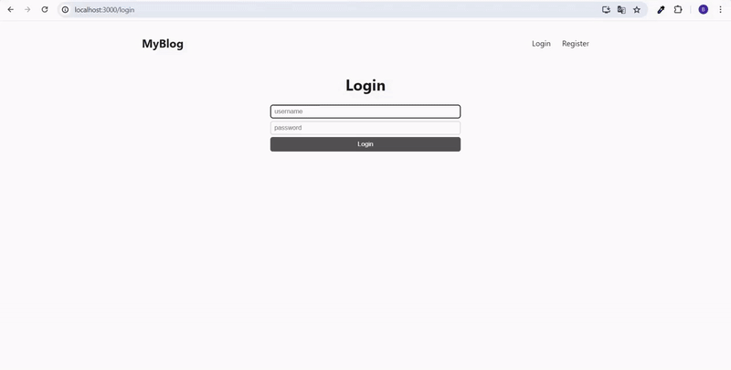

<h1>MY BLOG _mongodb_</h1>

My blog is a MERN full-stack application. On the backend, it integrates Express.js and MongoDB Atlas, utilizing JSON Web Token (JWT) for secure user session management. Database operations are handled using Mongoose, ensuring a simple, efficient, and reliable structure.

On the frontend, MyBlog employs React and React Router to provide users with an impressive and responsive interface. The React Quill editor offers authors rich text editing capabilities, while date-fns library simplifies date operations.

The development process of MyBlog is supported by Nodemon, enabling rapid feedback and live tracking of code changes. Additionally, it integrates tools such as bcrypt.js for secure password encryption and CORS support.

<h2> Software Languages </h2>

- HTML

- CSS

- JavaScript

<h2> Libraries </h2>

- React

- Mongoose

- Express JS

- React Router

- Multer

- Bcrypt JS

- Cookie-parser

- JSON Web Token (JWT)

<h2> Development Tools </h2>

- Nodemon

<h2> Screen Gif </h2>

